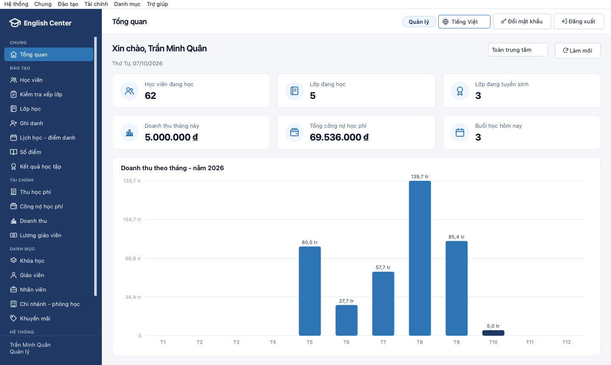
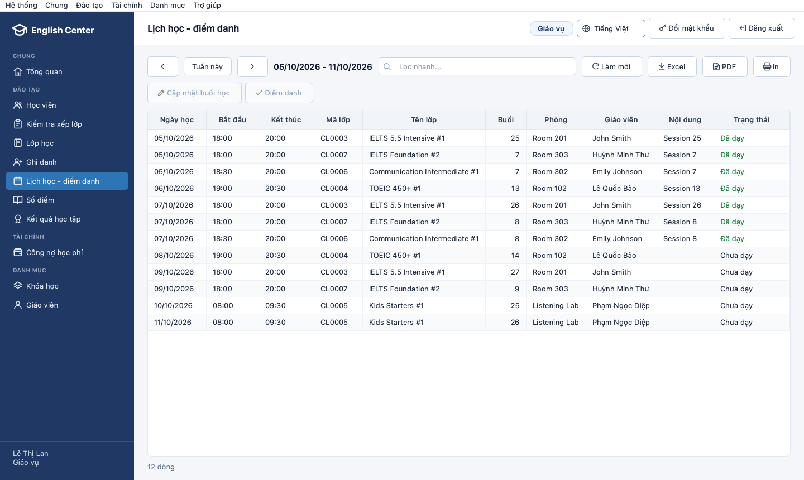
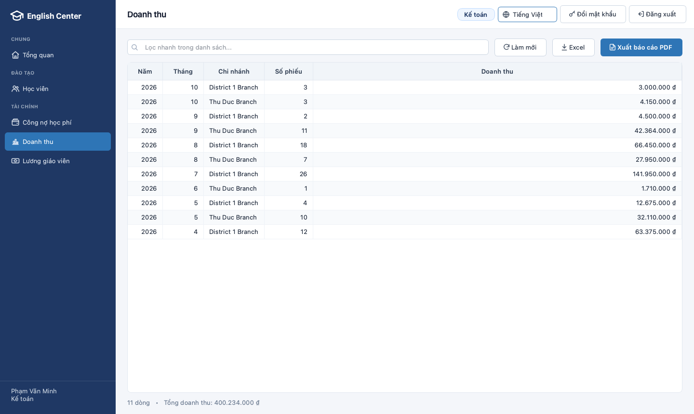
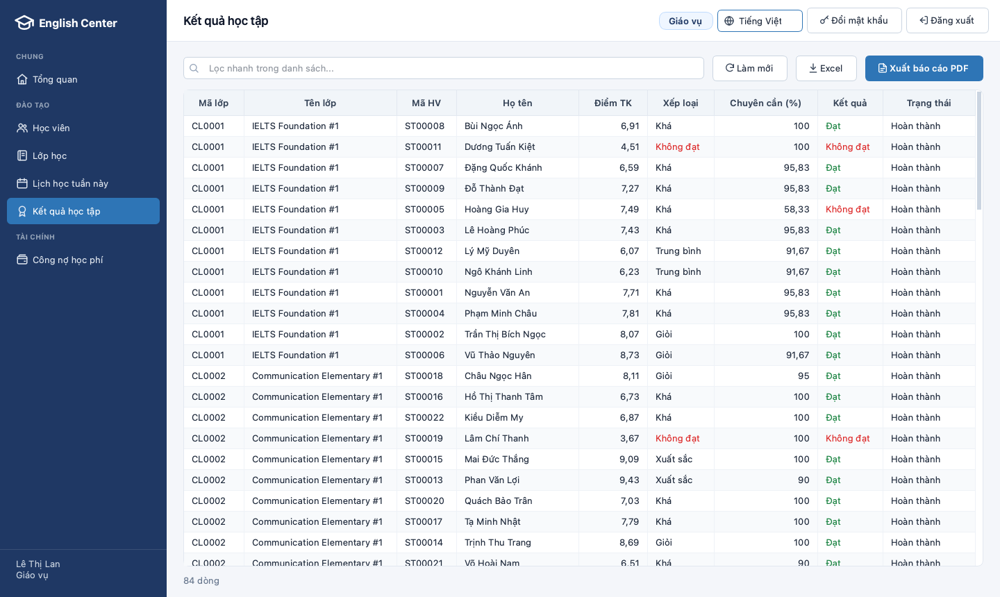
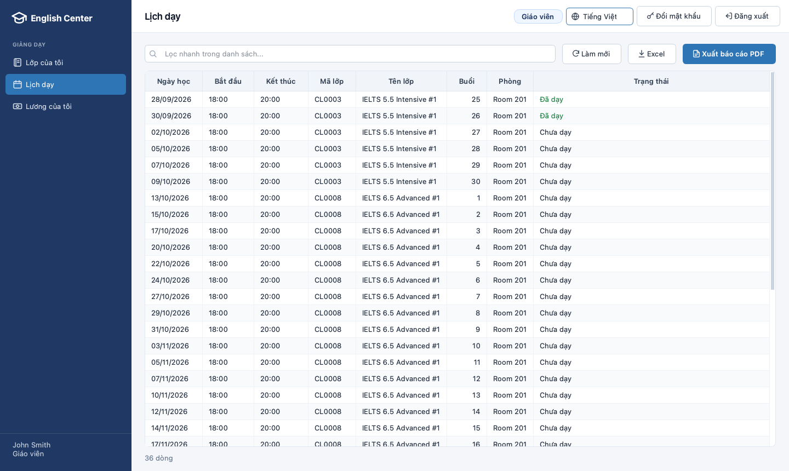
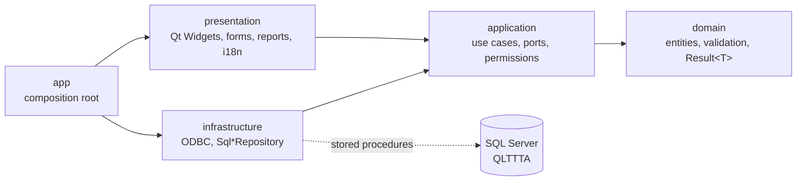

<div align="center">


# QLTTTA - English Center Management System

**A desktop application for running a chain of English-language centers, built around a SQL Server database.**

IE103 - Information Management · University of Information Technology (UIT), VNU-HCM · Group 1

[](https://github.com/nhutruong-uit/imcp/actions/workflows/ci.yml)
[](https://github.com/nhutruong-uit/imcp/actions/workflows/release.yml)


[Features](#features) · [Quick start](#quick-start) · [Testing](#testing) · [Architecture](#architecture) ·
[Documentation](#documentation) · [Team](#team)

</div>

<p align="center">
  
</p>

## Overview

QLTTTA (*Quản lý trung tâm tiếng Anh*, "English center management") covers the daily work of an English-language
center chain: students, courses, classes and timetables, enrollment, tuition and outstanding balances, attendance,
grades, certificates and teacher payroll.

The focus of the project is the **SQL Server database**: integrity constraints, stored procedures, functions, triggers,
cursors, views, authorization, backup/restore and XML/XQuery. The Qt application is the presentation layer on top of
it. Every write goes through a stored procedure and every user signs in as a real SQL Server user, so the database
itself enforces what each role may do.

## Features

### Database (SQL Server)
- **Integrity constraints** - primary and foreign keys, `CHECK`, `UNIQUE`, filtered unique indexes, and sequences for
  readable IDs (`ST00001`, `CL0001`)
- **Business rules in T-SQL** - stored procedures with transactions, scalar and table-valued functions, set-based
  `AFTER` / `INSTEAD OF` triggers (no room or teacher double-booking, amount paid = sum of receipts) and cursors
  (course results, monthly payroll)
- **Authorization** - contained database users in four roles, object- and column-level `GRANT` / `DENY`, ownership
  chaining through views and procedures, an append-only audit log
- **XML** - typed XML validated by an XSD (course syllabi), XQuery (`.value()`, `.nodes()`, `.modify()`),
  `FOR XML PATH`
- **Operations** - full / differential / log backup chain and restore, `BULK INSERT` and XML import/export, a
  branch-based distributed database (horizontal fragmentation, distributed view)
- **Automated tests in T-SQL** - business rules, constraints and permissions are covered by test cases that must be
  rejected for the right reason; server-level cases cover backup/restore, `BULK INSERT`, the distributed database
  and account lockout

### Application (Qt 6)
- **Role-based menu** for the manager, academic staff, accountant and teacher, matching the database permissions
- **Training**: dashboard, students, classes, weekly timetable, learning results.
  **Finance**: outstanding tuition, revenue, teacher payroll. **System**: account administration
- **Teachers** see only their own classes, teaching schedule and pay
- **Lists** with a quick filter, a totals row, PDF reports and CSV export
- **Vietnamese and English UI**, switchable at runtime; values and business messages from the database are translated
  too
- **Installers** for Windows (setup or portable ZIP) and macOS (`.dmg` with the FreeTDS driver bundled)

### Screenshots

<table>
  <tr>
    <td width="50%"></td>
    <td width="50%"></td>
  </tr>
  <tr>
    <td align="center"><sub>Weekly timetable - academic staff</sub></td>
    <td align="center"><sub>Revenue by month and branch - accountant</sub></td>
  </tr>
  <tr>
    <td width="50%"></td>
    <td width="50%"></td>
  </tr>
  <tr>
    <td align="center"><sub>Learning results - academic staff</sub></td>
    <td align="center"><sub>Own teaching schedule - teacher</sub></td>
  </tr>
</table>

<sub>Vietnamese UI (the default), generated from the seed data by `tools/qlttta_screenshots`.</sub>

## Tech stack

| Component | Technology |
|---|---|
| Database | Microsoft SQL Server 2012+ (T-SQL), contained database users, XML/XQuery |
| Application | C++17, Qt 6 Widgets, Qt SQL over ODBC (Microsoft ODBC Driver 18 or FreeTDS), Qt Linguist |
| Architecture | Clean Architecture: domain / application / infrastructure / presentation |
| Build and CI | CMake presets + Ninja, GitHub Actions, Inno Setup (Windows installer), `.dmg` packaging (macOS) |
| Tooling | clang-format, clangd, Claude Code with shared team rules (`AGENTS.md`, `.claude/`) |

## Quick start

> **Only want to try it?** Download the Windows installer or the macOS `.dmg` from
> [Releases](https://github.com/nhutruong-uit/imcp/releases) and follow
> [SETUP.md section 2](docs/SETUP.md#2-running-the-application-from-the-installer-level-a). The app still needs a
> SQL Server with the QLTTTA database (steps 1-2 below).

> **Joining the team?** One command installs what is missing on your machine, creates the database and runs the
> tests: `./scripts/setup_dev.sh --accept-licenses` on macOS, or
> `powershell -ExecutionPolicy Bypass -File scripts\setup_dev.ps1 -AcceptLicenses` on Windows (in Claude Code:
> `/imcp-setup`). See [SETUP.md section 3](docs/SETUP.md#one-command-setup-recommended); the manual steps follow.

### Prerequisites

| | macOS (Apple Silicon) | Windows 10/11 |
|---|---|---|
| SQL Server | Docker Desktop with Rosetta emulation enabled | SQL Server 2022 Developer or Express + SSMS |
| Toolchain | `brew install qt qt-unixodbc unixodbc freetds cmake ninja` | Qt Online Installer: Qt 6.8 MinGW 64-bit, CMake, Ninja, Qt Creator |

Minimum versions: Qt 6.7, CMake 3.25 and a C++17 compiler.

### macOS

```bash
# 1. SQL Server 2022 in Docker (container "imcp-mssql"); the .env file holds the sa password
echo 'MSSQL_SA_PASSWORD=<strong password>' > .env
docker compose up -d

# 2. Create the QLTTTA database: tables, functions, views, procedures, triggers, security, seed data
SQL_PASSWORD='<strong password>' ./scripts/db_init.sh --docker imcp-mssql

# 3. Build, run the unit tests and start the app
cmake --preset macos-debug && cmake --build --preset macos-debug && ctest --preset macos-debug
open build/macos-debug/src/app/QLTTTA.app
```

### Windows (PowerShell)

```powershell
# 1. Create the QLTTTA database (Windows Authentication; add -Server "localhost\SQLEXPRESS" for Express)
.\scripts\db_init.ps1

# 2. Build and run the unit tests (MinGW, CMake and Ninja from the Qt installation on PATH)
$env:QT_ROOT_DIR = "C:\Qt\6.8.3\mingw_64"
cmake --preset windows-debug; cmake --build --preset windows-debug; ctest --preset windows-debug
```

To run the app, open `CMakeLists.txt` in Qt Creator, pick the *Desktop Qt 6.8.x MinGW 64-bit* kit and press *Run*.

### Sign in

The login screen connects to `localhost,1433` by default; change it under *Server settings* (for example
`localhost\SQLEXPRESS`). Sign in as `ql_quan` (manager), `gvu_lan` (academic staff), `kt_minh` (accountant) or
`gv_john` (teacher). The shared demo password and every other account are listed in
[SETUP.md](docs/SETUP.md#demo-accounts-shared-password-demo2026).

The seed data uses dates relative to the day it is loaded: re-run `db_init` before a demo.

## Testing

One command runs the whole suite and stops at the first failing step. Run it before every pull request:

```bash
SQL_PASSWORD='<sa password>' ./scripts/test_all.sh --docker imcp-mssql
```

On Windows run `.\scripts\test_all.ps1`, which does the same steps.

1. **Change checks** - format of the changed C++ lines, commit messages, no build output or `.env` file tracked
2. **Database** - re-initialize from scratch, then `database/12_tests.sql`: constraints, business rules, functions,
   triggers, cursors, XML, permissions and schema conventions
3. **Server level** - `database/13_server_tests.sql`: backup/restore, `BULK INSERT`, the distributed database and
   account lockout
4. **Build and unit tests** - use cases with fake repositories, `tst_conventions` (layers, SQL location and syntax,
   numbers quoted in the docs) and `tst_i18n` (translations)
5. **End-to-end GUI tests** - every role opens every screen it may use, against the real database

| Workflow | Runs on | What it does |
|---|---|---|
| [Checks](.github/workflows/checks.yml) | pull requests into `develop` | Change checks, build and unit tests on Linux (no database) |
| [CI](.github/workflows/ci.yml) | merges into `develop`, pull requests into `main`, manual runs | Build and unit tests on macOS and Windows; the full `test_all` suite on Linux against SQL Server 2022 in Docker |
| [Release](.github/workflows/release.yml) | merges into `main` | Builds the `.dmg`, `setup.exe` and portable `.zip`, publishes a GitHub Release |

Details, options and the database-only test run in SSMS:
[SETUP.md](docs/SETUP.md#running-the-full-test-suite-with-one-command-before-every-pr).

## Architecture



- The dependency direction is enforced by CMake (`presentation` does not link `infrastructure`) and by
  `tst_conventions`.
- SQL lives only in `src/infrastructure/repositories`; every write calls a stored procedure, with values bound
  through `SqlHelpers::execPrepared`.
- Errors cross the layers as `Result<T>`; database messages are shown in the UI language.
- The Students module is the reference implementation; the recipe for a new module is in
  [ARCHITECTURE.md](docs/ARCHITECTURE.md#4-adding-a-new-module-cookbook).

## Repository layout

```
database/            SQL Server scripts: 00 create DB ... 07 seed data, 08-11 demos (queries / backup / import / distributed),
                     12-13 test suites (13 = server level), samples/ (CSV for BULK INSERT)
src/domain/          Entities + business rules (no dependency on the database or the UI)
src/application/     Use cases (services), ports (repository interfaces), role/menu permission matrix
src/infrastructure/  ODBC connection, repositories that call stored procedures, settings storage
src/presentation/    Qt Widgets UI (role-based menu, forms, PDF/CSV export of reports, i18n)
src/app/             Composition root (creates and wires the layers)
tests/               Unit tests (fake repositories), convention and translation checks, end-to-end GUI test
tools/               Screenshot generator used for the report and the user guide
resources/           Icons, the QSS style sheet and translations/qlttta_vi.ts (Vietnamese UI)
packaging/           Icons, Info.plist, Inno Setup installer, end-user install notes
scripts/             Dev machine setup, database init, change checks, full test run, macOS/Windows packaging
.github/             Workflows: Checks (PRs into develop), CI, Release (installers); the PR template
.claude/             Claude Code team setup: rules per area, skills, shared settings, C++ format hook
docs/                Documentation, the project report (docs/report) and the user guide (docs/user-guide)
AGENTS.md            Instructions for AI coding agents (read by Claude Code)
docker-compose.yml   SQL Server 2022 Developer for local development
```

## Documentation

| Document | Content |
|---|---|
| [docs/CODE_TOUR.md](docs/CODE_TOUR.md) | **Start here if you do not program**: reading the SQL scripts and the C++ code, one action followed from the click to the database, where each business rule lives, glossary |
| [docs/SETUP.md](docs/SETUP.md) | Environment setup on macOS/Windows, database initialization, demo accounts, tests, packaging, troubleshooting |
| [docs/ARCHITECTURE.md](docs/ARCHITECTURE.md) | Clean Architecture, request flow, naming conventions, adding a module, multi-language UI |
| [docs/DATABASE.md](docs/DATABASE.md) | Database design, object catalog, roles and permissions, mapping to the course syllabus |
| [docs/data-map.html](docs/data-map.html) | Interactive map to open in a browser: table relationships (click a table for its columns, keys, triggers and the screens that read it), the business flow step by step, the app flow by role |
| [docs/CONTRIBUTING.md](docs/CONTRIBUTING.md) | Git/GitHub workflow, coding conventions, pull request checklist, working with Claude Code |
| [docs/PLAN.md](docs/PLAN.md) | Schedule up to the submission date, member assignments, oral-defense preparation |
| [docs/report/](docs/report/) | The project report (.docx, .pdf; written in Vietnamese for the course) and the script that generates it |
| [docs/user-guide/](docs/user-guide/) | Installation and user guide for end users on macOS/Windows (.docx, .pdf; Vietnamese) and the script that generates it |
| [AGENTS.md](AGENTS.md) | Common commands and mandatory rules for AI coding agents, pointers to `.claude/rules/` |

## Contributing

- Branch from `develop` (`feature/...`, `fix/...`, `docs/...`, `chore/...`) and open a pull request into `develop`.
  `main` is protected and receives only releases.
- Everything in the repository is written in English: code, database objects and messages, docs, scripts and commit
  messages ([Conventional Commits](https://www.conventionalcommits.org/), e.g. `feat(students): ...`). The UI is
  translated into Vietnamese in `resources/translations/qlttta_vi.ts`; only the course report and the user guide
  are in Vietnamese.
- Run `scripts/test_all` before opening a pull request and paste its result line into the description.
- AI-assisted work follows [AGENTS.md](AGENTS.md) and `.claude/rules/`; the `/imcp-commit`, `/imcp-create-pr` and
  `/imcp-review` skills give every commit and pull request the same shape.

Full workflow and conventions: [docs/CONTRIBUTING.md](docs/CONTRIBUTING.md).

## Team

Class IE103.Q21.VB2 · Supervisor: Dr. Võ Phương Bình

| No. | Name | Student ID | Main responsibility |
|---|---|---|---|
| 1 | Trương Quang Như (team lead) | 25540022 | Architecture, application development, CI/CD, integration |
| 2 | Đỗ Phạm Minh Trâm | 25540042 | Domain survey, requirements analysis, ERD/CD |
| 3 | Nguyễn Việt Phú | 25540025 | Relational model, normalization, integrity constraints, triggers |
| 4 | Đỗ Bình Dương | 25540008 | Stored procedures, functions, cursors, SQL queries, XQuery |
| 5 | Nguyễn Bảo Giang | 25540009 | Data security, backup/restore, import/export, advanced databases |

Detailed assignments: [docs/PLAN.md](docs/PLAN.md).
