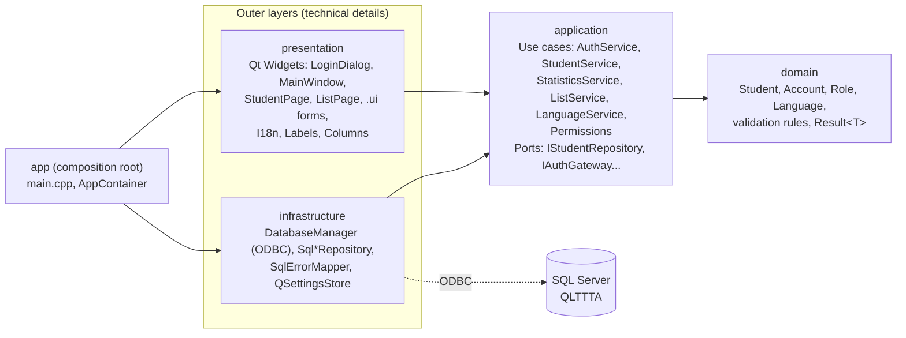
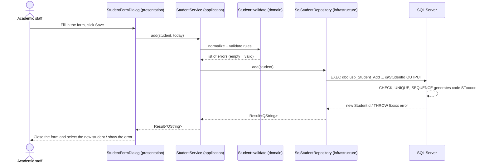

# Application architecture - Clean Architecture

## Naming conventions

Everything is written in English: the C++ code and the database (see `.claude/rules/01-sql.md`), so the C++ names follow
the database names directly - table `STUDENT` ↔ entity `Student`, column `StudentId` ↔ field `Student::id`,
`BranchId` ↔ `branchId`, procedures `usp_Student_Add/Update/Delete/Search/Details` ↔ `SqlStudentRepository::add/...`.
Role codes stored in `ACCOUNT.Role`: `MANAGER`, `ACADEMIC_STAFF`, `ACCOUNTANT`, `TEACHER` (`roleFromCode`).
Prefixes: `usp_` stored procedure, `fn_` function, `vw_` view, `trg_` trigger, `rl_` database role. In C++, interfaces
start with `I` (`IStudentRepository`) and infrastructure classes that talk to SQL Server start with `Sql`.

## 1. Layers and dependency direction

| Layer | CMake library | May depend on | Must not know about |
|---|---|---|---|
| `domain` | `qlttta_domain` | Qt Core | database, UI, use cases |
| `application` | `qlttta_application` | domain | Qt SQL, Qt Widgets |
| `infrastructure` | `qlttta_infrastructure` | application, Qt SQL | Qt Widgets |
| `presentation` | `qlttta_presentation` | application, Qt Widgets, Qt SVG | Qt SQL, SQL statements |
| `app` | `QLTTTA` (executable) | all of the above | - |

The dependency direction is enforced by `target_link_libraries` in CMake: `presentation` does not link
`infrastructure`, so the UI cannot call SQL directly. The `app` target (and the end-to-end test and the screenshot tool,
which reuse `AppContainer.cpp`) are the only places that see both sides.

**What this buys the project**
- All SQL lives in `infrastructure/repositories`, so it is easy to compare against the procedures in `database/`.
- The unit tests in `tests/tst_application.cpp` exercise the use cases with **fake repositories**; no SQL Server needed.
- Switching DBMS (e.g. to PostgreSQL) means rewriting the `Sql*Repository` classes only; the UI stays unchanged.
- Adding a UI language touches only the presentation layer and a translation file (section 5).

## 2. Example flow: adding a student

Rules are checked in **two places**: in the application (fast feedback) and in the database (CHECK / trigger /
procedure). The database is the final source of truth and also protects the data when it is edited directly from SSMS.
Business errors raised by the database (`THROW` / `RAISERROR`) are English sentences. `SqlErrorMapper` strips ODBC
driver noise from them and shows them in the UI language through the `DbMessages` catalog (exact messages, plus
templates such as `Class %1 is full.` for the messages the database builds from values); it also translates the
technical errors that have no business message: login/connection/certificate/permission failures and raw constraint
names such as `CK_STUDENT_Guardian`.

## 3. Login and authorization

1. `LoginDialog` → `AuthService::login` → `SqlAuthGateway`: opens an ODBC connection with the user's own username and
   password. SQL Server authenticates them (contained database user).
2. `SqlAuthGateway` calls `usp_Account_RecordLogin`, which records the login time and returns the row of the
   current user from `vw_CurrentAccount` (role, employee/teacher ID, full name, branch, status).
   A locked account is rejected; a valid SQL Server user with no row in `ACCOUNT` is rejected by `AuthService`
   ("valid SQL Server account, but no role is assigned"). The only exception is a database owner (`db_owner`, e.g.
   `sa`), who is admitted with the Manager role so the database can be administered from the app.
3. `Permissions::allowedFeatures(role)` decides which menu entries are shown.
4. From then on every query runs under that user's own permissions. If the application has a bug, SQL Server still
   blocks access through `GRANT/DENY` on the roles (`database/06_security.sql`; summary in
   [DATABASE.md](DATABASE.md#4-roles-and-permissions)). The application-side matrix only controls what is *displayed*.

## 4. Adding a new module (cookbook)

Example: an **Enrollment** module (not implemented yet; database table `ENROLLMENT`). The reference implementation is
the Students module (`Student*`).

1. **Database**: the procedures already exist (`usp_Enrollment_Create`, `usp_Enrollment_ByClass`, ...). For new ones,
   write them in `04_procedures.sql`, add `GRANT EXECUTE` in `06_security.sql` and register their business messages in
   `DbMessages.cpp`.
2. **domain**: `src/domain/entities/Enrollment.h` - a struct plus a `validate()` function if there are rules.
3. **application**: port `src/application/ports/IEnrollmentRepository.h`, use case
   `src/application/services/EnrollmentService.{h,cpp}`; register both in `src/application/CMakeLists.txt`.
4. **infrastructure**: `SqlEnrollmentRepository.{h,cpp}` calling the procedures (template: `SqlStudentRepository.cpp`;
   run every statement with values through `SqlHelpers::execPrepared(q, m_db, sql, {values})`; for OUTPUT parameters
   use the batch `SET NOCOUNT ON; DECLARE ...; EXEC ... OUTPUT; SELECT ...`, and pass NULLs with
   `SqlHelpers::stringOrNull`). Add the files to `src/infrastructure/CMakeLists.txt`.
5. **presentation**: an `EnrollmentPage` and a `.ui` form (open it in Qt Designer) in `src/presentation/enrollments/`;
   template: `students/`. Every user-visible string goes through `tr()` (section 5).
6. **app**: create the repository and the service in `AppContainer`, and expose the service through `AppServices`.
7. **Authorization**: add `Feature::Enrollments` to the matrix in `Permissions.cpp` for the right roles, add its menu
   text/icon in `Labels::feature`, and return the page from `MainWindow::pageFor`.
8. **Tests**: add a use-case test with a fake repository in `tests/`. The end-to-end test
   `everyRole_opensEveryFeature_withData` automatically opens every feature listed in `Permissions`, so a new screen
   is covered as soon as it is in the matrix. New business rules or permissions also need a case in
   `database/12_tests.sql` (see [CONTRIBUTING.md](CONTRIBUTING.md)).
9. **Translations**: `cmake --build --preset macos-debug --target update_translations`, then translate the new entries
   of `resources/translations/qlttta_vi.ts`; `tst_i18n` fails while any entry is untranslated.

**Read-only list screens need no new page.** Features such as classes, timetable, outstanding tuition, revenue or
payroll are all rendered by the generic `ListPage`. To add one: add a `Feature` value and a `ListKind` value
(`IListRepository.h`), map them in `ListService.cpp`, and add the `SELECT` / `EXEC` for that list in
`SqlListRepository.cpp` (a view or procedure granted to the role). The result columns are identified by their
**column keys** (column names or `AS` aliases); every new key needs a row in the column catalog
(`src/presentation/common/Columns.cpp`) with its English title, money/total flags and, for summable columns, the label of
the totals line. The end-to-end test fails when a displayed column has no catalog entry.

## 5. Multi-language UI (English / Vietnamese)

The user picks the language on the login screen or in the header of the main window; the choice is remembered and
Vietnamese is the default. Design:

| Concern | Where | How |
|---|---|---|
| Source strings | every layer | English, inside `tr("...")`. Non-QObject classes use `Q_DECLARE_TR_FUNCTIONS`; namespaces use a small helper struct (`LabelsText::tr`). Domain/application only need Qt Core for this. |
| Vietnamese translation | `resources/translations/qlttta_vi.ts` | Qt Linguist file; `lrelease` builds `qlttta_vi.qm` at build time and embeds it as `:/i18n/qlttta_vi.qm` (`qt_add_translations` in `src/presentation/CMakeLists.txt`). |
| Which language | `LanguageService` (application) + `ISettingsStore` | Use case that reads/saves the choice (`QSettings` key `ui/language` = `vi` / `en`). |
| Applying it | `I18n` (presentation) | `I18n::apply` installs the `QTranslator` and sets the default `QLocale` (number grouping, weekday/month names). |
| Switching at runtime | `main.cpp` | `LoginDialog` closes with `LanguageChanged`, `MainWindow` emits `languageChangeRequested`; the loop in `main.cpp` rebuilds the window in the new language and keeps the session, current page and window geometry. No per-widget re-translation code is needed. |
| Codes → text | `Labels`, `Columns` (presentation) | Inner layers only hold codes (`Role`, `Feature`, column keys). Role/menu names come from `Labels`; column titles and formatting rules (money, totals, debt highlighting, role codes, schedules) from `Columns`. |
| Database values | `DbValues` | Enumerated values stored in English (`Studying`, `Female`, ...): `label()` shows them as they are in English and translates them (context `DbValues` of the `.ts` file) in Vietnamese; `tone()` decides the table highlighting (passed/taught/active account green, failed/cancelled/locked red). Combo boxes show the label and keep the stored value as item data. |
| Database messages | `DbMessages` (infrastructure) | Business messages of `THROW`/`RAISERROR` (English), translated in context `DbMessages`; messages built from values match a template (`Class %1 is full.`) and keep the values. |
| Formatting | `Format` | `Format::money` / `Format::month` / `Format::weekday` follow the default locale (`6.500.000 ₫` vs `6,500,000 ₫`, `T1` vs `Jan`, `T2` vs `Mon`); `Format::schedule` localizes the day names of the weekly schedule built by `vw_ClassDetails` (`Mon 18:00-20:00` → `T2 18:00-20:00`); dates stay `dd/MM/yyyy`; `Format::dateTime` shows an instant read from the database (UTC, columns `...Utc`) in the time zone of the computer. |

Not translated on purpose: free-text data (names, addresses, branch/course/class names).

**Rule: no logic depends on displayed text.** Money columns, totals and highlighting are decided by column keys and
stored values; file names of screenshots come from fixed per-feature names. The first version of the lists recognized
money columns and built the totals line from the Vietnamese header text ("Còn nợ"), which would have broken as soon as
the header was translated; column keys replaced it.

Guards: `tests/tst_i18n.cpp` (runs on CI) fails when the `.ts` file has an unfinished entry, when a menu/role/column text
is not translated, when a value of a `CHECK ... IN (N'...')` constraint in `database/01_tables.sql` is not registered in
`DbValues` or has no Vietnamese label, or when a `THROW`/`RAISERROR` message of `04_procedures.sql`/`05_triggers.sql`
is not in `DbMessages`; the end-to-end test `language_switchToEnglish_rebuildsUi` switches the real UI to English and
back, and `changePassword_wrongCurrentPassword_showsError` checks a database message shown in Vietnamese.

Workflow for a new string: write it in English with `tr()` → `cmake --build --preset <preset> --target
update_translations` (runs `lupdate` over the four layers) → translate it in Qt Linguist (or in the `.ts` file) → build.

## 6. Database connection on each operating system

`DatabaseManager` tries the ODBC drivers one after another (`DatabaseManager::candidateDrivers`) and stops at the first
one that connects. A driver named in the environment variable `QLTTTA_ODBC_DRIVER` (name or path) is always tried first,
which helps when diagnosing.

| OS | Driver order |
|---|---|
| Windows | ODBC Driver 18 → ODBC Driver 17 → "SQL Server" (the legacy driver built into Windows) |
| macOS (.dmg build) | bundled FreeTDS → ODBC Driver 18/17 (if installed) |
| macOS (development) | ODBC Driver 18/17 → Homebrew FreeTDS |

**FreeTDS and Unicode.** Qt's ODBC plugin turns Unicode off when the driver is FreeTDS, so a `QString` parameter
reaches SQL Server as `VARCHAR` and is converted through the database code page (`Vietnamese_CI_AS` = 1258): accents
of letters such as "ồ", "ễ" are stored decomposed (and a search for them finds nothing), other characters become `?`.
`SqlHelpers::execPrepared` therefore sends, on a FreeTDS connection only, every text value with a non-ASCII character
as its UTF-16LE bytes and turns it back into `NVARCHAR` on the server
(`DECLARE @UnicodeText1 NVARCHAR(MAX) = CAST(CAST(? AS VARBINARY(MAX)) AS NVARCHAR(MAX))`) - the value stays a
parameter. Reading is not affected (FreeTDS converts results to UTF-8, `ClientCharset=UTF-8`). CI runs the end-to-end
test through both ODBC Driver 18 and FreeTDS.

If SQL Server answers with a login failure (wrong password, or the database cannot be opened) the search stops
immediately because another driver would fail the same way. Other errors (missing driver, TLS, network) make it try
the next driver. Connections request encryption (all drivers except the legacy Windows "SQL Server" one). The "Trust
server certificate" option is on by default because the Docker image uses a self-signed certificate; it is stored in the
settings and should be turned off in the login dialog when the server has a certificate from a trusted CA.
