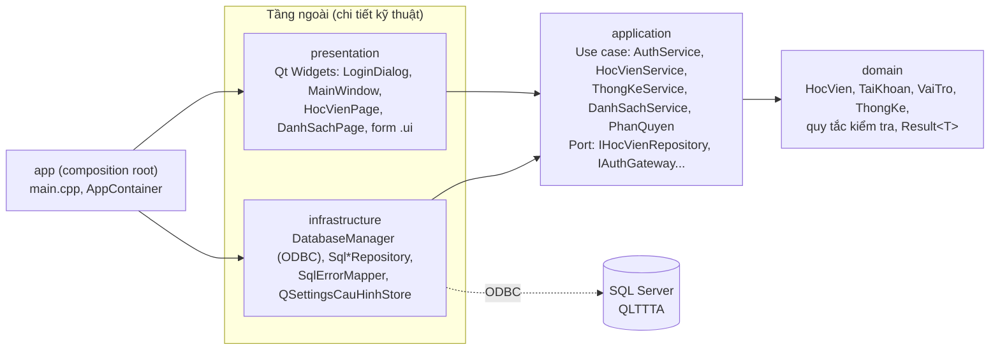
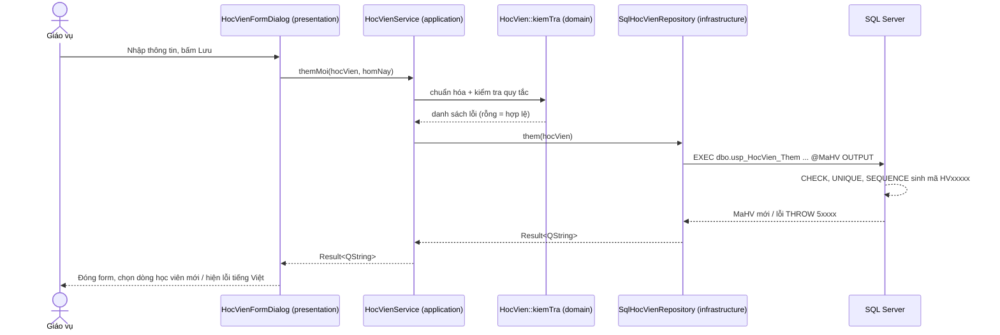

# Kiến trúc ứng dụng - Clean Architecture

## 1. Các tầng và chiều phụ thuộc

| Tầng | Thư viện CMake | Được phụ thuộc vào | Không được biết tới |
|---|---|---|---|
| `domain` | `qlttta_domain` | Qt Core | CSDL, giao diện, use case |
| `application` | `qlttta_application` | domain | Qt SQL, Qt Widgets |
| `infrastructure` | `qlttta_infrastructure` | application, Qt SQL | Qt Widgets |
| `presentation` | `qlttta_presentation` | application, Qt Widgets | Qt SQL, câu lệnh SQL |
| `app` | `QLTTTA` (exe) | tất cả | - |

Chiều phụ thuộc được ép bằng `target_link_libraries` trong CMake: `presentation` không link
`infrastructure`, nên giao diện không thể gọi SQL trực tiếp.

**Lợi ích cụ thể trong đồ án**
- Toàn bộ SQL nằm ở `infrastructure/repositories` → dễ đối chiếu với thủ tục trong `database/`.
- Unit test `tests/tst_application.cpp` kiểm thử use case bằng **repository giả**, không cần SQL Server.
- Đổi DBMS (vd. PostgreSQL) chỉ cần viết lại các lớp `Sql*Repository`, giao diện giữ nguyên.

## 2. Luồng xử lý ví dụ: thêm học viên

Quy tắc được kiểm tra **2 lớp**: tại ứng dụng (phản hồi nhanh) và tại CSDL (CHECK/trigger/thủ tục -
nguồn sự thật cuối cùng, bảo vệ cả khi dữ liệu được sửa bằng SSMS).

## 3. Đăng nhập và phân quyền

1. `LoginDialog` → `AuthService::dangNhap` → `SqlAuthGateway`: mở kết nối ODBC bằng chính
   tên đăng nhập/mật khẩu người dùng. SQL Server xác thực (contained database user).
2. Gọi `usp_TaiKhoan_GhiNhanDangNhap` → đọc vai trò từ `vw_TaiKhoanHienTai`.
3. `PhanQuyen::chucNangDuocPhep(vaiTro)` quyết định menu hiển thị.
4. Mọi truy vấn sau đó chạy dưới quyền của user đó: nếu ứng dụng có lỗi, SQL Server vẫn chặn
   bằng `GRANT/DENY` trên role (`06_security.sql`).

## 4. Thêm một module mới (cookbook)

Ví dụ module **Ghi danh** (chưa làm):

1. **CSDL**: thủ tục đã có (`usp_GhiDanh`, `usp_GhiDanh_TheoLop`...). Nếu thêm mới → viết trong
   `04_procedures.sql`, `GRANT EXECUTE` trong `06_security.sql`.
2. **domain**: `src/domain/entities/GhiDanh.h` - struct + hàm `kiemTra()` nếu có quy tắc.
3. **application**: port `src/application/ports/IGhiDanhRepository.h`, use case
   `src/application/services/GhiDanhService.{h,cpp}`; thêm vào `src/application/CMakeLists.txt`.
4. **infrastructure**: `SqlGhiDanhRepository.{h,cpp}` gọi thủ tục (mẫu: `SqlHocVienRepository.cpp`,
   tham số OUTPUT dùng lô lệnh `DECLARE ... EXEC ... OUTPUT; SELECT`).
5. **presentation**: trang `GhiDanhPage` + form `.ui` (mở bằng Qt Designer), mẫu: `hocvien/`.
6. **app**: khởi tạo repository + service trong `AppContainer`, thêm vào `AppServices`.
7. **Phân quyền**: thêm `ChucNang::GhiDanh` vào `PhanQuyen.cpp` cho vai trò phù hợp; nối trang trong
   `MainWindow::trangCho`.
8. **Test**: thêm test use case với repository giả trong `tests/`.

## 5. Kết nối CSDL trên từng hệ điều hành

`DatabaseManager` thử lần lượt các ODBC driver và dừng ở driver đầu tiên kết nối được:

| Hệ điều hành | Thứ tự driver |
|---|---|
| Windows | ODBC Driver 18 → ODBC Driver 17 → "SQL Server" (driver có sẵn của Windows) |
| macOS (bản .dmg) | FreeTDS đóng gói kèm → ODBC Driver 18/17 (nếu đã cài) |
| macOS (dev) | ODBC Driver 18/17 → FreeTDS của Homebrew |

Nếu SQL Server phản hồi "sai mật khẩu" thì dừng ngay; các lỗi khác (thiếu driver, TLS) thì thử driver tiếp theo.
Biến môi trường `QLTTTA_ODBC_DRIVER` cho phép chỉ định driver cụ thể khi chẩn đoán.
