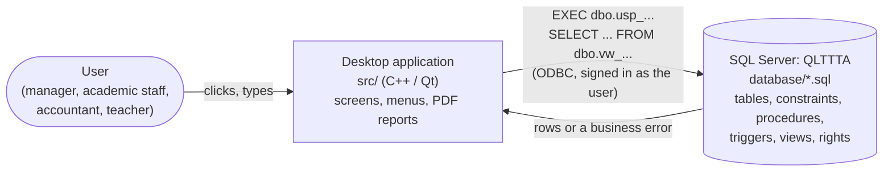

# Code tour - reading QLTTTA when you are not a programmer

This guide is for every team member, whatever their major. It assumes the SQL of the IE103 course (tables,
constraints, procedures, triggers, views, `GRANT`) and **no programming experience**. Read it once, then open the
files of your area: every file starts with a header comment that says what it is for, and the comments inside
explain the steps and name the course concepts you will be asked about at the oral defense.

Deeper references: [DATABASE.md](DATABASE.md) (database design and permissions), [ARCHITECTURE.md](ARCHITECTURE.md)
(application design), [SETUP.md](SETUP.md) (install, run, demo accounts), [PLAN.md](PLAN.md) (who owns what).

## 1. The big picture



- The **database is the heart of the project** (and of the grade). Every business rule is guaranteed there:
  constraints, triggers and stored procedures reject bad data even when someone types SQL directly in SSMS.
- The **application only shows screens**. It never writes to a table itself: every change is an `EXEC` of a
  stored procedure, and almost every list is a `SELECT` on a view (the account list calls a procedure, the payroll
  list reads `PAYROLL` with a column-level `GRANT`).
- Every user signs in as a **real SQL Server user** (a contained database user). SQL Server, not the application,
  decides what that user may read or change (`GRANT`/`DENY` in `06_security.sql`). Hiding a menu entry in the
  application is only a convenience.

The folders you will meet:

| Folder | What it is | Who should read it |
|---|---|---|
| `database/` | SQL scripts that build the whole database, plus demo and test scripts | everyone |
| `src/` | The desktop application (C++ and the Qt library) | the application owner; others only the flows of section 5 |
| `tests/`, `database/12_tests.sql`, `database/13_server_tests.sql` | Automatic proofs that the rules work | everyone (good evidence at the defense) |
| `docs/` | Documentation, the course report (`docs/report/`) and the installation and user guide (`docs/user-guide/`), both in Vietnamese | everyone |
| `scripts/` | One-command tools: create the database, run every test, build installers | whoever runs them |

## 2. Where to start for your area

The areas follow the assignments of [PLAN.md](PLAN.md#2-assignments).

| Area | Read in this order | Try it yourself |
|---|---|---|
| Analysis, ERD | [DATABASE.md](DATABASE.md) sections 2-3, then the header of every table in `database/01_tables.sql` | Draw one table from its `CREATE TABLE` and check it against the ERD |
| Relational model, constraints, triggers | `01_tables.sql`, `05_triggers.sql`, then the `T..` cases of `12_tests.sql` that name them | Break a rule inside a transaction (section 3.4) and read the error |
| Procedures, functions, cursors, XML | `02_functions.sql`, `04_procedures.sql` (start with group A, Students), `08_demo_queries.sql` | Run a procedure inside `BEGIN TRANSACTION ... ROLLBACK` |
| Security, backup, distributed database | `03_views.sql` (teacher views), `06_security.sql`, `09`-`11`, the `P..` cases of `12_tests.sql` and the `S..` cases of `13_server_tests.sql` | Sign in to SSMS as the teacher `gv_john` (section 3.5) |
| Application | Section 4 and 5 of this guide, then [ARCHITECTURE.md](ARCHITECTURE.md), then the Students module | Run the application with each of the four roles |

## 3. Reading a SQL script

### 3.1 The order of the scripts

`scripts/db_init` runs `00` to `07` in order, because an object can only use objects that already exist:

| Script | Creates | Why at this position |
|---|---|---|
| `00_create_database.sql` | the database and its options | everything lives inside it |
| `01_tables.sql` | sequences, the XML schema, tables, constraints | the data comes first |
| `02_functions.sql` | functions (`fn_`) | views and procedures call them |
| `03_views.sql` | views (`vw_`) | procedures and the application read them |
| `04_procedures.sql` | stored procedures (`usp_`) | the only way the application writes |
| `05_triggers.sql` | triggers (`trg_`) | rules that the constraints alone cannot express |
| `06_security.sql` | roles (`rl_`), users and permissions | can only grant objects that exist |
| `07_seed_data.sql` | demo data, with dates relative to the day you run it | needs every object above: classes, enrollments, results, payroll and accounts are created through the procedures |

`08`-`11` are demonstrations to run by hand in SSMS; `12` and `13` are the automatic test suites.

### 3.2 Anatomy of a stored procedure

A shortened copy of `usp_Student_Add` (`database/04_procedures.sql`), with numbered marks explained below:

```sql
/* A1. usp_Student_Add: add a student, return the new ID through an OUTPUT parameter */     -- (1)
IF OBJECT_ID(N'dbo.usp_Student_Add', N'P') IS NOT NULL DROP PROCEDURE dbo.usp_Student_Add;    -- (2)
GO                                                                                         -- (3)
CREATE PROCEDURE dbo.usp_Student_Add
    @FullName       NVARCHAR(100),                                                         -- (4)
    @Phone          VARCHAR(15)   = NULL,                                                  -- (4)
    @StudentId      VARCHAR(10)   OUTPUT                                                   -- (5)
AS
BEGIN
    SET NOCOUNT ON;                                                                        -- (6)
    IF @Phone IS NOT NULL AND EXISTS (SELECT 1 FROM dbo.STUDENT WHERE Phone = @Phone)
        THROW 50002, N'The phone number is already used by another student.', 1;           -- (7)

    DECLARE @New TABLE (StudentId VARCHAR(10));
    INSERT INTO dbo.STUDENT (FullName, Phone /* ... */)
    OUTPUT inserted.StudentId INTO @New                                                    -- (8)
    VALUES (LTRIM(RTRIM(@FullName)), NULLIF(@Phone, '') /* ... */);
    SELECT @StudentId = StudentId FROM @New;
END;
GO
```

1. **Header comment**: section code (`A1` = group A, Students), name and purpose. Read it first.
2. **Re-runnable script**: drop the old version if it exists, so the script can run again (SQL Server 2012 has
   no `CREATE OR ALTER`).
3. **`GO`** ends a batch for SSMS/sqlcmd; `CREATE PROCEDURE` must be the first statement of its batch.
4. **Parameters**: the inputs. `= NULL` makes a parameter optional.
5. **`OUTPUT` parameter**: a value the procedure gives back, here the new student ID.
6. **`SET NOCOUNT ON`**: do not send "1 row affected" messages (a team rule, checked by test `T30`).
7. **Business rule + `THROW`**: refuse the call with an error number and an English message. The application
   shows the message in the user's language (`DbMessages` + `resources/translations/qlttta_vi.ts`).
8. **`OUTPUT inserted.StudentId INTO @New`**: copies the ID that the database generated (a `SEQUENCE` used as the
   column `DEFAULT`, `ST00001`...) into a table variable, so it can be returned.

The constraints of table `STUDENT` (`CHECK`, `UNIQUE`, foreign keys) still apply to the `INSERT`: the procedure
checks what it can explain nicely, the constraints are the final guard.

Multi-step procedures (enrollment, receipts, payroll) add a transaction: `SET XACT_ABORT ON` (any error cancels the
whole transaction) and `BEGIN TRY ... COMMIT ... END TRY BEGIN CATCH ... ROLLBACK; THROW; END CATCH`. The template
is in `.claude/rules/01-sql.md`.

### 3.3 Anatomy of a trigger

A trigger runs automatically after (or instead of) an `INSERT`, `UPDATE` or `DELETE` on its table. Inside it, two
read-only pseudo-tables hold the rows of that statement: **`inserted`** (new versions) and **`deleted`** (old
versions). One statement can change **many rows at once**, so a correct trigger always joins with `inserted` /
`deleted` (set-based) and never copies "the" row into a variable. Example: `trg_RECEIPT_UpdateAmountPaid` in
`05_triggers.sql` recomputes `ENROLLMENT.AmountPaid` for every enrollment touched by the statement, and cancels the
statement (`RAISERROR` + `ROLLBACK TRANSACTION`) when the receipts would exceed the tuition.

- `AFTER` trigger: checks or completes the change once it is done (it can still roll it back).
- `INSTEAD OF` trigger: replaces the statement, e.g. `trg_RECEIPT_PreventDelete` turns every `DELETE` of a receipt
  into an error, so financial documents are never deleted.

### 3.4 Trying things safely in SSMS

Wrap your experiment in a transaction and roll it back: the database is left exactly as it was. This is also how
every case of `database/12_tests.sql` works.

```sql
USE QLTTTA;
BEGIN TRANSACTION;
DECLARE @Id VARCHAR(10);
EXEC dbo.usp_Student_Add @FullName = N'Nguyễn Thử Nghiệm', @DateOfBirth = '20000501', @Gender = N'Female',
     @Phone = '0999000111', @BranchId = 'BR01', @StudentId = @Id OUTPUT;
SELECT StudentId, FullName, Status, RegisteredOn FROM dbo.STUDENT WHERE StudentId = @Id;
ROLLBACK TRANSACTION;   -- undo everything
```

Now break a rule: change `@DateOfBirth` to `'20140101'` (a 12-year-old without guardian details) and run it again.
SQL Server refuses the row with the constraint `CK_STUDENT_Guardian` - the same check that test `T01` proves. If an
error stops the script before `ROLLBACK`, run `ROLLBACK TRANSACTION;` on its own.

### 3.5 Seeing the permissions with your own eyes

The demo accounts of [SETUP.md](SETUP.md#demo-accounts-shared-password-demo2026) are real SQL Server users. In SSMS,
connect with *SQL Server Authentication* as `gv_john` and choose the database `QLTTTA` under *Options > Connection
Properties > Connect to database* (a contained user lives inside the database, not on the server). Then:

```sql
SELECT FullName FROM dbo.STUDENT;                -- refused: DENY SELECT for the teacher role (test P01)
SELECT * FROM dbo.vw_Teacher_MyStudents;         -- works: only the students of gv_john's classes (test P02)
```

The view works although the table is denied because of **ownership chaining**: the view and the table have the
same owner (`dbo`), so SQL Server checks the permission on the view only. The view itself filters the rows by the
signed-in user, so each teacher sees only their own students.

## 4. Reading a C++ file

### 4.1 Two files per class

Most parts of the application come as a pair:

- `Something.h` (header): **what** the part offers - its name, the data it holds and the functions it has, with a
  comment above each. **Read this one first.**
- `Something.cpp` (source): **how** each function works.

The folder tells you the layer (section 4.3), the file name tells you the part: `StudentService` = the use cases
of the students, `SqlStudentRepository` = the SQL calls for students, `StudentPage` = the students screen.

### 4.2 Reading a line of C++

| You see | It means |
|---|---|
| `// text` or `/* text */` | a comment, ignored when the program is built |
| `#include "domain/entities/Student.h"` | use another file; the path shows its layer |
| `struct Student { QString fullName; QDate dateOfBirth; };` | a record type with fields (like the columns of a row) |
| `class StudentService { public: ... private: ... };` | a type with data and functions; `public` parts can be used by other code, `private` parts only inside |
| `Result<QString> add(const Student& student, const QDate& today);` | a function `add` that takes a student and a date and returns "the new ID or an error" ([Result.h](../src/domain/common/Result.h)) |
| `const` | read-only: this function or value does not change anything |
| `Student&` (with `&`) | a reference: work on the original object, no copy is made |
| `Student*` (with `*`), `p->name` | a pointer (the address of an object); `->` reads a field through it |
| `QString`, `QDate`, `QList<Student>`, `QVariant` | Qt types: text, date, list of students, "any value from the database" |
| `auto x = ...;` | let the compiler work out the type |
| `if (!result.ok()) return ...;` | `!` means "not": stop here when the result is an error |
| `tr("Save")` | text shown to the user; English in the code, Vietnamese in `resources/translations/qlttta_vi.ts` |
| `namespace Format { ... }`, `Format::money(x)` | a named group of functions and how to call one of them |
| `connect(button, &QPushButton::clicked, this, &StudentPage::add);` | "when the button is clicked, run `add`" (Qt signals and slots) |
| `[this] { ... }` | a lambda: a small function written in place, often what a click runs |
| `virtual ... = 0;` / `override` | a function of an interface (a "port") / the code that a class supplies for it |
| `std::optional<Account>` | "an account or nothing" |
| `QStringLiteral("...")` | a fixed piece of text (faster than building it at run time) |

### 4.3 The layers

The application is split into layers ([ARCHITECTURE.md](ARCHITECTURE.md#1-layers-and-dependency-direction));
code may only use the layers to its right in this line: `presentation -> application -> domain <- infrastructure`.

| Layer (folder under `src/`) | In one sentence | Example |
|---|---|---|
| `domain` | business data and rules, with no database or screen | `Student` and `Student::validate` |
| `application` | the use cases: check the rules, then ask a port for the data | `StudentService::add`, `Permissions` |
| `infrastructure` | the only place with SQL: connection, procedure calls, error messages | `SqlStudentRepository`, `DatabaseManager` |
| `presentation` | the screens (Qt Widgets), texts, formats | `StudentPage`, `StudentFormDialog` |
| `app` | starts the program and wires the layers together | `main.cpp`, `AppContainer` |

The test `tst_conventions` fails if a file breaks this direction or puts SQL outside `infrastructure`.

## 5. Following one action from the click to the database

### 5.1 Adding a student

| Step | Where (file - function) | What happens |
|---|---|---|
| 1 | `src/presentation/students/StudentPage.cpp` - `add` | the Add button opens the form |
| 2 | `src/presentation/students/StudentFormDialog.cpp` - `save`, `readForm` | the form is read into a `Student` |
| 3 | `src/application/services/StudentService.cpp` - `add` | the input is cleaned (`normalized`) and checked (`Student::validate`) |
| 4 | `src/infrastructure/repositories/SqlStudentRepository.cpp` - `add` | `EXEC dbo.usp_Student_Add ... @StudentId = @NewId OUTPUT`, values as parameters (`SqlHelpers::execPrepared`) |
| 5 | `database/04_procedures.sql` - `usp_Student_Add` | business checks (`THROW`), `INSERT`; the constraints of `STUDENT` and the ID sequence apply |
| 6 | back in `StudentFormDialog::save` and `StudentPage::add` | the new ID comes back as a `Result`; the list is reloaded and the new row selected |

If SQL Server refuses the student, `SqlErrorMapper` (in `src/infrastructure/db/`) turns the raw error into a short
message, `DbMessages` translates the business messages, and the form shows it without closing.

### 5.2 Signing in

`LoginDialog::login` -> `AuthService::login` -> `SqlAuthGateway::login` -> `DatabaseManager::open` opens an ODBC
connection **with the user's own name and password** (SQL Server checks them) -> `EXEC dbo.usp_Account_RecordLogin`
stores the login time and returns the user's row of `vw_CurrentAccount` (role, name, branch) -> the main window
builds its menu from `Permissions::allowedFeatures(role)`. From then on, every query runs with that user's rights.

### 5.3 Opening a list (for example Outstanding tuition)

Menu click -> `MainWindow::onMenuRowChanged` -> `ListPage` -> `ListService::fetch` (checks the role may open it) ->
`SqlListRepository::fetch` runs `SELECT ... FROM dbo.vw_OutstandingTuition` -> SQL Server checks the
`GRANT SELECT` of the view for the user's role -> the rows come back as `TableData` -> `TableDataModel` shows them,
with the titles and money format of the column catalog (`src/presentation/common/Columns.cpp`) and a totals line.

## 6. Where each business rule lives

The application checks some rules early to give a quick message; the database **guarantees** all of them; a test
case proves it. Use this table to find the code behind a rule during the defense.

| Rule | Application (quick message) | Database (final guard) | Test case |
|---|---|---|---|
| A student under 18 needs a guardian name and phone | `Student::validate` | `CK_STUDENT_Guardian` | `T01` |
| A student with an enrollment history is never deleted | - | `usp_Student_Delete` | `T41` |
| A class whose students paid cannot be cancelled | - | `usp_Class_UpdateStatus` | `T42` |
| A class goes Enrolling → In progress → Finished or Cancelled, never back (a new class instead); cancelling closes its enrollments | - | `usp_Class_UpdateStatus` | `T54`, `T55` |
| A changed class keeps at least its enrolled students, moves its start date only while it is enrolling and no session took place (also past its old end date), and its new teacher or room is checked for clashes | - | `usp_Class_Update`, `trg_CLASS_SCHEDULE_CheckConflict` fired again | `T72`, `T73`, `T74`, `T83`, `T101`, `T102`, `T114` |
| Only the timetable of an Enrolling or In progress class changes | - | `usp_ClassSchedule_Add`, `usp_ClassSchedule_Remove` | `T75`, `T94`, `T112` |
| A student is Completed after the last class, Studying again with the next enrollment | - | `usp_Class_EvaluateResults`, `usp_Enrollment_Create` | `T71` |
| Phone numbers have 9-11 digits | `Student::validate`, digits-only fields | `CK_STUDENT_Phone` | `T02` |
| No double enrollment in a class | - | `usp_Enrollment_Create`, `UQ_ENROLLMENT_StudentId_ClassId` | `T03` |
| Entry requirement (prerequisite course or placement score) | - | `usp_Enrollment_Create` | `T04`, `T33`, `T65` |
| A student cannot take two classes at the same time, also when a class gets a new slot or start date | - | `fn_StudentScheduleClash` in `usp_Enrollment_Create`, `usp_Enrollment_TransferClass`, `usp_Enrollment_UpdateStatus`, `usp_ClassSchedule_Add`, `usp_Class_Update` | `T05`, `T34`, `T52`, `T105`, `T111` |
| A completed enrollment keeps its status (grade and result come from the evaluation) | - | `usp_Enrollment_UpdateStatus` | `T53` |
| Amount paid = sum of valid receipts, never above the tuition | - | `trg_RECEIPT_UpdateAmountPaid` | `T06`, `T20` |
| A transfer stays in the course and branch and applies the tuition of the new class | - | `usp_Enrollment_TransferClass` | `T14`, `T46`, `T47`, `T70` |
| Receipts are never deleted | - | `trg_RECEIPT_PreventDelete`, `DENY DELETE` | `T07`, `P08` |
| A receipt printed again shows the amount paid and the balance right after that payment | - | `usp_Receipt_Print` (running total) | `T107` |
| Only accountants and managers collect money | no menu entry | `DENY EXECUTE` on `usp_Receipt_Create` to academic staff | `P16` |
| No room or teacher double-booking | - | `trg_CLASS_SCHEDULE_CheckConflict` | `T08` |
| A class uses a room of its own branch, which holds its size | - | `trg_CLASS_CheckRoom`, `trg_ROOM_CheckClasses` | `T09`, `T61` |
| Grades are between 0 and 10 | - | `CK_GRADE_Score` | `T10` |
| Grades, attendance and sessions are final once the class is finished | - | `usp_Grade_Save`, `usp_Attendance_Save`, `usp_Session_Update` | `T43`, `T44`, `T56` |
| Attendance counts the sessions taught since the student joined the class (enrollment or transfer) | - | `fn_AttendanceRate`, `ENROLLMENT.ClassJoinedOn` | `T48`, `T69` |
| The grade components of an evaluated course are frozen | - | `trg_GRADE_COMPONENT_Lock` | `T68` |
| A class is evaluated only when no session is still scheduled | - | `usp_Class_EvaluateResults` | `T57` |
| The audit log is append-only | - | `trg_AUDIT_LOG_ReadOnly`, `DENY UPDATE, DELETE` | `T11`, `P14`, `P15` |
| Certificates only for students who passed, also after a re-evaluation | - | `trg_CERTIFICATE_CheckResult`, `usp_Class_EvaluateResults` | `T12`, `T23`, `T35` |
| Attendance only for students of the session's class | - | `trg_ATTENDANCE_CheckClass` | `T37` |
| A grade belongs to a component of the class's course | - | `trg_GRADE_CheckComponent` | `T38` |
| Every change of a grade is logged | - | `trg_GRADE_Audit` | `T39` |
| A taught session cannot be moved or set back; a future session cannot be marked taught | - | `trg_CLASS_SESSION_LockTaught` | `T13`, `T50`, `T51` |
| A full class accepts nobody else | - | `trg_ENROLLMENT_CheckCapacity` | `T21` |
| A teacher sees only their own classes and students | teacher menu (`Permissions`) | `DENY SELECT` on `STUDENT`, `RECEIPT`, `PAYROLL`, the `vw_Teacher_My*` views | `P01`, `P02`, `P18`, `P19` |
| A teacher changes only their own classes (grades, attendance, sessions) | - | `usp_Grade_Save`, `usp_Attendance_Save`, `usp_Session_Update` | `P03`, `P21`, `P20` |
| An accountant cannot enroll students or change grades | no menu entry | `DENY EXECUTE` on `usp_Enrollment_Create`, `usp_Grade_Save` | `P04`, `P17` |
| Only academic staff and managers edit students | `Permissions::canEditStudents` | `GRANT EXECUTE` on `usp_Student_*` | end-to-end test |
| Usernames use letters without diacritics, digits, `.` and `_` | - | `usp_Account_Create` | `T36` |
| No account for an employee or teacher who has left | - | `usp_Account_Create` | `T62` |
| A paid payroll row is final; a deduction never makes the pay negative, also when a month is finalized again with a lower rate | - | `usp_Payroll_Adjust`, `usp_Payroll_MarkPaid`, `CK_PAYROLL_Deduction` | `T80`, `T81`, `T82`, `T103`, `T113` |
| Catalog codes are new and use letters, digits, `-` and `_` only | `Fields::code` (input validator) | `usp_Branch_Add`, `usp_Room_Add`, `usp_Program_Add`, `usp_Course_Add`, `usp_Promotion_Add` | `T84`, `T95` |
| A branch or course used by an active class is not suspended or discontinued | - | `usp_Branch_Update`, `usp_Course_Update` | `T85`, `T89` |
| The prerequisites of the courses never form a loop | - | `usp_Course_Update` (recursive CTE) | `T90` |
| A syllabus follows the XML schema of the center | - | `xsc_CourseSyllabus` (typed XML), `usp_Course_SetSyllabus` | `T91` |
| A grade component with scores is not deleted, and no component moves to another course | - | `usp_GradeComponent_Delete`, `usp_GradeComponent_Save` | `T93`, `T104` |
| A teacher or employee still needed (active class, active account) does not leave | - | `usp_Teacher_Update`, `usp_Employee_Update` | `T98`, `T110` |
| Only the manager changes the catalogs; the accountant changes no class | menu and buttons (`Permissions::canEdit`) | no `GRANT EXECUTE` on the group J procedures for the other roles; `usp_Class_Update` granted to academic staff | `P22`, `P23` |
| Texts fit their columns (no silent cut) | `Student::validate`, field lengths | column sizes | `tst_domain` |

## 7. Glossary

| Term | Meaning in this project |
|---|---|
| Contained database user | a user whose password is stored in the database itself (no server login), so it travels with a backup |
| Role (`rl_...`) | a group of users; permissions are granted to roles, never to single users |
| `GRANT` / `DENY` / `REVOKE` | allow / forbid (wins over any `GRANT`) / remove a previous `GRANT` or `DENY` |
| Ownership chaining | objects with the same owner (`dbo`) do not re-check permissions on each other, so a role can use a view or procedure without rights on its tables |
| `EXECUTE AS OWNER` | a procedure runs with the rights of its owner (used for accounts and backups) |
| Stored procedure (`usp_`) | named T-SQL code with parameters; the only way the application changes data |
| Function (`fn_`) | returns a value (scalar) or a table (inline or multi-statement table-valued); used inside queries |
| View (`vw_`) | a saved `SELECT`; the application reads most lists through views |
| Trigger (`trg_`) | code run automatically by `INSERT`/`UPDATE`/`DELETE`; `inserted`/`deleted` hold the rows |
| Cursor | reads a result row by row (used where each row needs its own steps: results, payroll) |
| Transaction, `XACT_ABORT` | a group of changes that succeed or fail together; `XACT_ABORT ON` cancels it on any error |
| `THROW` / `RAISERROR` | raise an error with a message (procedures use `THROW`, triggers `RAISERROR`) |
| Sequence | a number generator, used in `DEFAULT` values to build IDs such as `ST00001` |
| UTC instant, center date | a moment (when a receipt was paid) is stored in UTC in a column named `...Utc`; a business date (the day a student registered) is a day of the center (UTC+07:00), given by `fn_Today` - nothing depends on the time zone of the server |
| Filtered unique index (`UX_`) | uniqueness only for rows that have a value (several students may have no email) |
| Typed XML, XSD, XQuery | XML checked against a schema; `.value()`, `.query()`, `.nodes()`, `.exist()`, `.modify()` read or change it |
| Derived attribute | a value computable from others but stored (e.g. `AmountPaid`), kept correct by a trigger |
| Layer, Clean Architecture | the split of `src/` into domain, application, infrastructure, presentation (section 4.3) |
| Use case / service | one thing a user can do (`StudentService::add`) with its rules |
| Port / interface | a list of functions without code that another layer implements (`IStudentRepository`) |
| Repository | the class that stores and loads one kind of data (`SqlStudentRepository`) |
| Fake repository | an in-memory stand-in used by the unit tests instead of SQL Server |
| Composition root | `src/app/AppContainer`: the one place that creates and connects all objects |
| ODBC, FreeTDS | the standard way to reach a database driver; FreeTDS is the open-source driver bundled on macOS |
| i18n | internationalization: the UI in Vietnamese or English |
| Model / view | Qt's split between the data of a table (model) and the widget that draws it (view) |
| Signal / slot | Qt's events: a signal ("clicked") runs the connected slot (a function) |
| Unit / end-to-end test | a test of one part without a database / a test that clicks through the real application |
| CI | GitHub Actions: builds and tests every merge automatically |

## 8. Common questions

**I changed a SQL script. What now?** Re-run `scripts/db_init` (the scripts must work from scratch), add or update
a case in `database/12_tests.sql`, and run the whole suite with `scripts/test_all`. The checklist is in
[CONTRIBUTING.md](CONTRIBUTING.md#database-database).

**Where does the Vietnamese text of a database error come from?** The procedure or trigger raises an English
message; `src/infrastructure/db/DbMessages.cpp` lists every message, and `resources/translations/qlttta_vi.ts` holds
its Vietnamese translation. `tst_i18n` fails when a message is missing from either.

**The application hides a menu entry - is that the security?** No. It only avoids showing screens that would fail.
The security is the `GRANT`/`DENY` of `06_security.sql`, proved by the `P..` test cases.

**How do I find everything about one object?** Search its name in the whole repository (VS Code: *Edit > Find in
Files*; GitHub: the search box). For `usp_Student_Add` you find the definition (`04_procedures.sql`), the
permission (`06_security.sql`), the C++ call (`SqlStudentRepository.cpp`) and the tests (`12_tests.sql`).

**Can I ask Claude Code to explain a file?** Yes (allowed by the instructor). Ask it to explain a file or one
object in Vietnamese, then run the statements yourself in SSMS and write the explanation in your own words.
