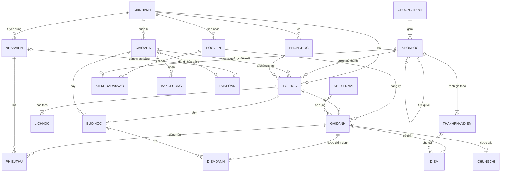

# Thiết kế cơ sở dữ liệu QLTTTA

> Bản đầy đủ (ERD ký hiệu Chen, lược đồ quan hệ kèm tân từ, từ điển dữ liệu, ràng buộc toàn vẹn,
> giải thích từng thủ tục/trigger) nằm trong báo cáo `docs/report/`. Tài liệu này là bản tra cứu nhanh.

## 1. Vì sao chọn SQL Server (không phải SQLite)

Đề cương IE103 yêu cầu: stored procedure, function, trigger, cursor, xác thực và phân quyền CSDL,
view, backup/restore, import/export, XPath/XQuery; công cụ thực hành là SSMS.

| Yêu cầu môn học | SQLite | PostgreSQL | **SQL Server** |
|---|---|---|---|
| Stored procedure / Function | Không | Có (PL/pgSQL) | **Có (T-SQL, giống bài lab)** |
| Trigger / Cursor | Trigger hạn chế / Không | Có | **Có** |
| Xác thực, user, role, GRANT/DENY | Không | Có | **Có (+ contained user)** |
| Backup Full/Differential/Log | Sao chép file | pg_dump/WAL | **Có (T-SQL BACKUP/RESTORE)** |
| XML + XPath/XQuery | Không | Chỉ XPath 1.0 | **XQuery đầy đủ (.query/.value/.nodes/.exist/.modify)** |
| Công cụ trên lớp | - | - | **SSMS** |
| Phát hành ứng dụng không cần cài DB | Rất dễ | Khó | Cần SQL Server (Express miễn phí / Docker) |

## 2. Sơ đồ thực thể - liên kết (rút gọn)

## 3. Danh sách bảng (21)

| Nhóm | Bảng | Ý nghĩa |
|---|---|---|
| Tổ chức | `CHINHANH`, `PHONGHOC` | Chi nhánh, phòng học (cơ sở cho thiết kế CSDL phân tán theo chi nhánh) |
| Nhân sự | `NHANVIEN`, `GIAOVIEN`, `TAIKHOAN` | Nhân viên văn phòng, giáo viên (hồ sơ năng lực XML), tài khoản ↔ user SQL Server |
| Đào tạo | `CHUONGTRINH`, `KHOAHOC`, `THANHPHANDIEM` | Chương trình, khóa học (đề cương XML có XSD, khóa tiên quyết đệ quy), cột điểm + trọng số |
| Lớp học | `LOPHOC`, `LICHHOC`, `BUOIHOC` | Lớp, lịch tuần, từng buổi học (sinh tự động) |
| Học viên | `HOCVIEN`, `KIEMTRADAUVAO`, `GHIDANH` | Học viên, kiểm tra xếp lớp (đề xuất khóa học), ghi danh (n-n HOCVIEN-LOPHOC) |
| Tài chính | `KHUYENMAI`, `PHIEUTHU`, `BANGLUONG` | Khuyến mãi, phiếu thu nhiều đợt, lương giáo viên theo tháng |
| Kết quả | `DIEMDANH`, `DIEM`, `CHUNGCHI` | Điểm danh theo buổi, điểm thành phần, chứng nhận hoàn thành |
| Hệ thống | `NHATKYHETHONG` | Nhật ký kiểm toán (dữ liệu cũ/mới dạng XML) |

## 4. Đối tượng CSDL và nội dung môn học

| Nội dung đề cương | Hiện thực trong đồ án | File |
|---|---|---|
| Mô hình quan niệm, logic; ERD, CD | 21 thực thể, liên kết đệ quy, n-n, chuyên biệt hóa (người) | báo cáo Ch.3 |
| Ràng buộc toàn vẹn | 21 PK, 32 FK, 72 CHECK, 13 UNIQUE + 5 filtered unique index, 44 DEFAULT, 8 SEQUENCE | `01_tables.sql` |
| Mô hình XML | XML có kiểu (XSD) cho đề cương khóa học, XML không kiểu cho hồ sơ giáo viên, nhật ký | `01`, `07` |
| Truy vấn SQL | JOIN, GROUP BY/HAVING, NOT EXISTS, phép chia, CTE, đệ quy, window function, PIVOT | `08_demo_queries.sql` |
| XPath/XQuery | `.value() .query() .exist() .nodes() .modify()`, FLWOR, `sql:variable`, `FOR XML PATH` | `04`, `08` |
| Stored procedure | 38 thủ tục: nghiệp vụ, giao dịch, tham số OUTPUT, dynamic SQL an toàn, `EXECUTE AS OWNER` | `04_procedures.sql` |
| Function | 10 scalar, 2 inline TVF, 1 multi-statement TVF | `02_functions.sql` |
| Trigger | 13 trigger: AFTER/INSTEAD OF, ràng buộc liên quan hệ, thuộc tính dẫn xuất, audit | `05_triggers.sql` |
| Cursor | Xét kết quả cuối khóa, chốt lương tháng, nạp dữ liệu mẫu | `04`, `07` |
| View | 13 view, gồm 5 view bảo mật lọc theo giáo viên đang đăng nhập | `03_views.sql` |
| Xác thực / phân quyền | Contained user, 4 role, GRANT/DENY mức đối tượng và mức cột, ownership chaining | `06_security.sql` |
| Backup / Restore | Full + Differential + Log, phục hồi chuỗi NORECOVERY/RECOVERY, VERIFYONLY | `09_backup_restore.sql`, `usp_SaoLuu` |
| Import / Export | FOR XML, nhập XML qua `.nodes()`, BULK INSERT, bcp/sqlcmd, xuất CSV/PDF từ ứng dụng | `10_import_export.sql` |
| Menu / Form / Report | Ứng dụng Qt: menu theo vai trò, form Qt Designer, báo cáo PDF có header/footer/tổng | `src/presentation` |
| CSDL phân tán | Phân mảnh ngang theo chi nhánh, nhân bản danh mục, view phân tán, kiểm tra đầy đủ/tách biệt | `11_distributed_demo.sql` |
| CSDL hướng đối tượng, NoSQL | Chuyển đổi mô hình và so sánh | báo cáo Ch.7 |

## 5. Quy tắc nghiệp vụ chính (được CSDL bảo đảm)

1. Học viên dưới 18 tuổi phải có họ tên + SĐT phụ huynh; phải có ít nhất một số liên lạc.
2. Phòng của lớp thuộc cùng chi nhánh; sĩ số tối đa ≤ sức chứa phòng.
3. Không trùng lịch phòng/giáo viên giữa các lớp đang hoạt động; học viên không học 2 lớp trùng giờ.
4. Ghi danh: lớp còn chỗ và đang mở; đạt khóa tiên quyết **hoặc** điểm kiểm tra đầu vào ≥ yêu cầu.
5. Đã đóng = tổng phiếu thu hợp lệ (trigger), không thu vượt học phí; phiếu thu không được xóa, chỉ được hủy có lý do.
6. Điểm 0-10, đúng cột điểm của khóa; giáo viên chỉ nhập điểm/điểm danh lớp mình dạy.
7. Đạt khi điểm tổng kết ≥ 5 và chuyên cần ≥ 80%; chỉ lượt ghi danh Đạt mới được cấp chứng nhận.
8. Buổi đã dạy không được đổi giờ/phòng/giáo viên (giữ đúng dữ liệu tính lương).
9. Nhật ký hệ thống chỉ được ghi thêm (INSTEAD OF UPDATE, DELETE + DENY cho cả quản lý).
